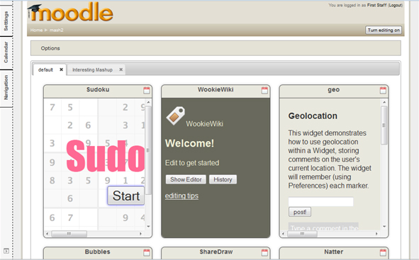

mashup-doodle
=============

A mashup type course format for moodle which allows a teacher to define pages of aggregated widgets in various column/row layouts and share these with students.  These pages can also be imported/exported in <a href="http://omdl.org/">OMDL format</a>. 

At present the mashup format only supports W3C widgets, but there is further scope to support other types, such as Open Social gadgets.

Getting Started
---------------

(1) Download and install Moodle (http://download.moodle.org/)
	
	(Note: This code base is being primarily developed against Moodle 2.4 on Windows using the XAMPP package)
	
(2) Create a new folder called "mashup" under path-to-moodle/course/format/

	i.e. Create "path-to-moodle/course/format/mashup"
	
(3) Check out this project and put everything in the folder you just created

(4) Download & start Apache Wookie (http://wookie.apache.org/)

	You can use the standalone binary version found below if you don't want to build it yourself.
	 
[Wookie binary download page](http://wookie.apache.org/docs/download.html)

	 

(5) Startup Moodle

	Login as an administrator and go to the notification pages.  Moodle should have found the new course format 
	follow the on screen instructions to install the new format.
	
(6) Create a new course

	As a course creator/teacher create a new course based on the "mashup" course format.